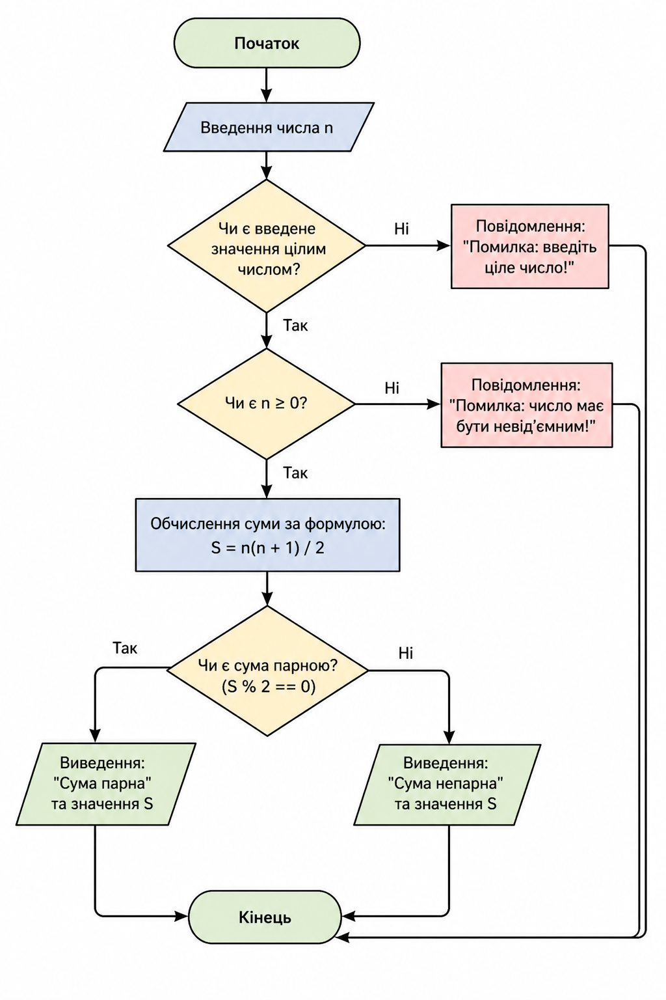

# **Проєкт на Python**

## **1\. Опис проєкту**

Даний проєкт демонструє реалізацію алгоритму обчислення суми чисел від 1 до N з перевіркою парності результату. Додатково врахована обробка помилок введення та використана більш ефективна формула обчислення.

Мета \- показати базову алгоритміку, оптимізацію та оформлення технічної документації.

---

## **2\. Алгоритм роботи**

1. Користувач вводить число N  
2. Перевіряється коректність введення  
3. Обчислюється сума за формулою  
4. Перевіряється парність результату  
5. Виводиться результат

---

## Код на Python

```python
def calculate_sum(n):
    return n * (n + 1) // 2

try:
    n = int(input("Введіть число: "))
    if n < 0:
        print("Число має бути додатнім")
    else:
        result = calculate_sum(n)

        if result % 2 == 0:
            print("Сума парна:", result)
        else:
            print("Сума непарна:", result)

except ValueError:
    print("Помилка: введіть ціле число")
```

### **Пояснення:**

* Використовується формула n(n+1)/2 замість циклу  
* try/except обробляє помилки введення  
* Перевірка n \< 0 захищає від некоректних значень

---

## **4\. Візуалізація** 

## Блок-схема


---

### **4.2 Діаграма етапів**

![][image2]

---

### **4.3 Інтелект-карта**

![][image3]


